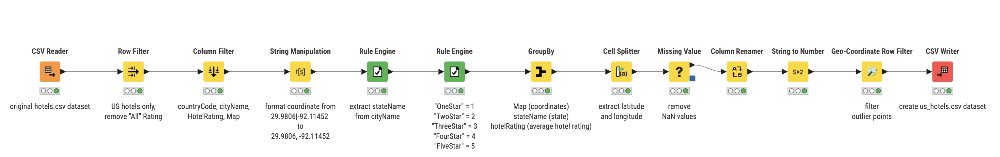
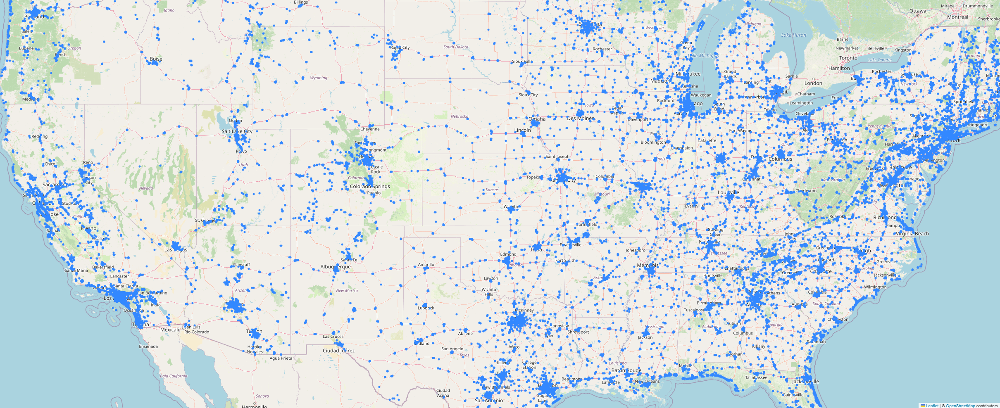
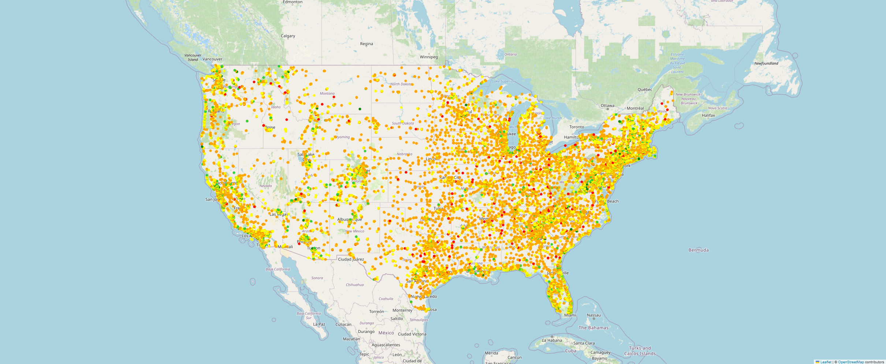
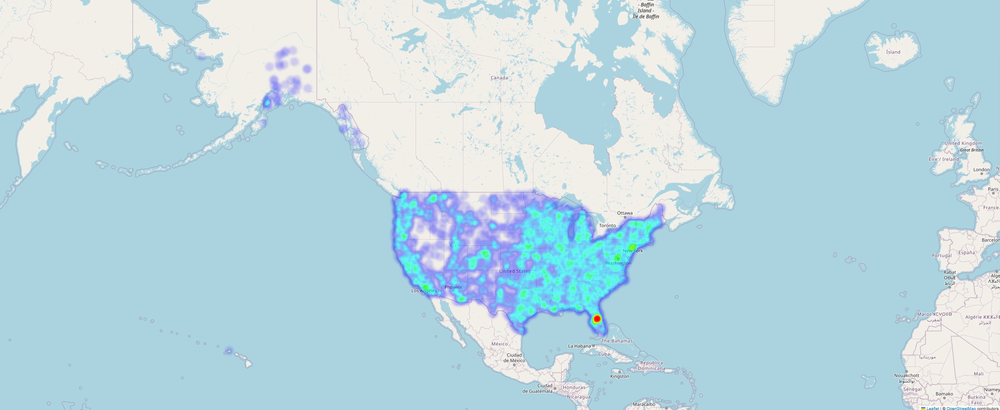
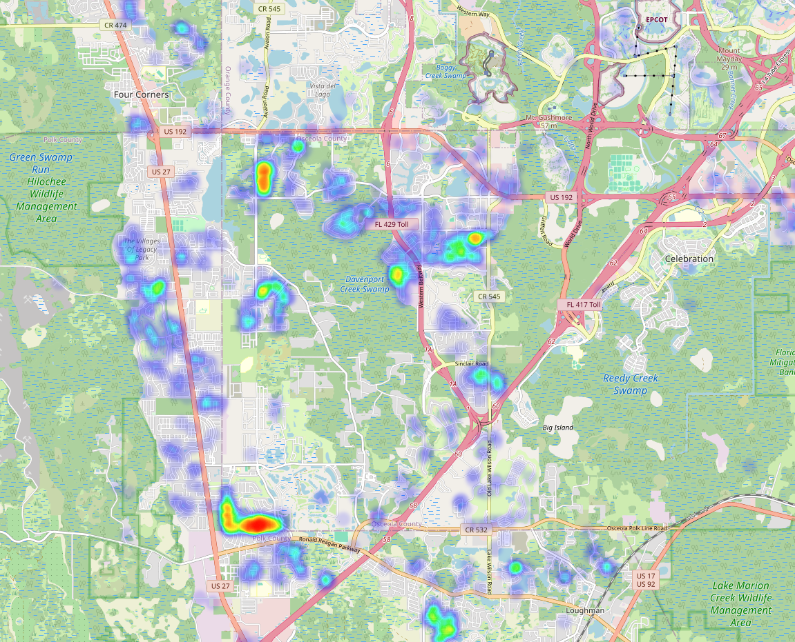
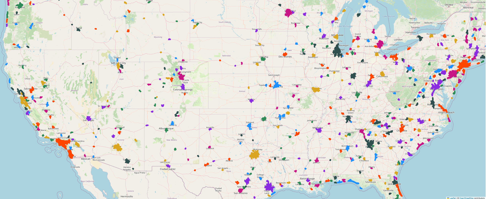

# Post Apocalypse Hotels
## Inspiration
*Did you experience the 5th wave and need shelter, supplies, and entertainment?*  
*Are you tired of scavenging for food, water, and beds?*  
*Want to be part of a community again after most of humanity have been taken over by aliens?*  

The answer to all of these can be found at **hotels**!

While it depends on the hotel, as some can be poor, one-star motels while others can be grand, five-star resorts,
they all at the very least offer shelter and a bed. Many hotels, especially in urban areas, offer food from their lounges or restaurants
inside or nearby the hotel. Some hotels can even have pools, TV, arcades, and other entertainment services. Because hotels are designed to be an
"all-in-one" package-- in a fresh post-apocalyptic scenario, I think it is best to capitalize on the many amenities hotels offer. Depending on who finds them, 
a family with wounds might be saved upon stumbling a motel along a highway road. Perhaps, larger hotels are converted into makeshift communities with chaotic governments. 
A hotel may even be an entertainment playground for relieving the stresses of a post apocalyptic world.

---

This project looks at cleaning up a large dataset, applying post-processing tools to help visualze geospatial data, and using clustering techniques
to find key areas with an abundance of hotels. 

## Software
I use **Google Colab** (Jupyter) notebooks, which by default already has many python libraries installed. This is the recommended and intended way to run, view, and edit the code within this repository. Google Colab notebooks can be opened
using Google Colab itself (recommended), or using VSCode. These are the following libraries used:
```
pandas    #used for dataframes and data manipulation
scikit-learn    #used for dbscan clustering algorithm
folium    #used for visualization on maps
```

For the majority of pre-processing, I use **KNIME** as my preferred data mining software. Furthermore, I used a KNIME community node called "Geo-Coordinate Row Filter". 
This is the link to download it: https://hub.knime.com/knime/extensions/org.knime.features.ext.osm/latest/org.knime.ext.osm.node.rowfilter.GeoRowFilterNodeFactory

## Dataset
The original dataset is from Kaggle, from user @raj713335 with the dataset name "Hotels Dataset".  
The link can be found here: 
https://www.kaggle.com/datasets/raj713335/tbo-hotels-dataset  

I chose this dataset because of the large amount of recorded hotels with coordinate points. I liked and wanted to focus on
visualizing geospatial patterns using Folium, and this dataset did not have much work done on it (atleast on Kaggle).

Note that the original dataset covers multiple countries, so in order to not break Google Colab, I limit the scope
of this project to the United States (including Alaska and Hawaii). I also aim to look at the average hotel ratings
for a given hotel. Therefore, from the original dataset, I remove most attributes such as
"PhoneNumber", "PinCode", "HotelWebsiteUrl", and other irrelevant attributes.  

Below is a random sample of what the cleaned dataset looks like.
|ID| Map | stateName | HotelRating |  Latitude |  Longitude |
|---|---|---|---|---|---|
|16125| 32.33016, -106.78285 | New Mexico | 2.0 | 32.330160 | -106.782850 |
|21015| 33.57551, -111.927296  | Arizona | 3.0 | 33.575510 |-111.927296 |
|51809| 40.523094, -105.05278  | Colorado | 2.0 | 40.523094 | -105.052780 |
|61550| 42.6154, -88.58454 | Wisconsin | 3.0 | 42.615400 | -88.584540 |
|56022| 41.32587, -105.60971  | Wyoming | 2.0 | 41.325870 | -105.609710 |
|...|...|...|...|...|...|

## Installation
In a terminal, enter the following command to clone this repository.
```
git clone https://github.com/alfredsoriano/post-apocalypse-hotels.git
```
This repository contains the **.ipynb** (Interactive Python NoteBook) file, which can be opened in either
[Google Colab](https://colab.research.google.com/) or VSCode. Once installed, make sure to run the first code block
to import all the needed libraries into the notebook. If running the code on Google Colab, you can press `ctrl + F9`
to run all code blocks in sequence.

This repository also contains the **.knwf** (KNIME Workflow) file, which can be opened using the KNIME software.

## Visualizations & Analysis
### KNIME Data Pre-Processing

This image is the combination of nodes in KNIME used to clean the original dataset into the "us_hotels.csv" dataset present in this
repository. I added comments under each node in order to help explain what each node specifically does or targets.

### Hotel Map:

This map looks at the 71,598 different hotel locations on a map. There are some interesting patterns to note,
primarily that we can notice a web-like pattern where hotels are along major roads, and condense in major cities.
Following a road means a potential encounter with a hotel, which at the very least means shelter.

### Hotel Ratings Map:

This map shows the hotel map but with each hotel colored according to its hotel rating.
These hotels are color-mapped according to the following criteria:    <br>
0 < rating <= 1 : red  <br>
1.1 < rating <= 2 : orange  <br>
2.1 < rating <= 3 : yellow  <br>
3.1 < rating <= 4 : limegreen  <br>
4 < rating <= 5 : green  <br>
We can see that most hotels are around the 2-3 star rating. However, in an apocalypse, I'm sure they would all feel like 5 stars.

### Heatmap:

This heatmap is useful for finding density (with noise). Of course, the locations with the most hotels are major urban cities,
such as Los Angeles, New York, and Chicago. Furthermore, there seems to be an abundance of hotels within the 
eastern-half of the U.S. Interestingly, we can see that Florida has an extremely high density of hotels.
This is due to a collection of hotels in a "hotel neighborhood" in Orlando (see heatmap below).

### Heatmap of Orlando:

This heatmap specifically looks at the Orlando, Florida area where the high density heat markers are. The reason the 
high density is due to a a few specific "hotel neighborhoods" where each house/villa is considered a hotel itself.
One such cluster is the "Paradise Palms" villas in the top-left, red heat cluster. The most dense of these "hotel neighborhoods"
is the "Dreamscape Villas" seen in the bottom left. These luxurious hotels are "Vacation Home Rentals".  

&nbsp;

Perhaps Orlando may be a prime candidate for setting up a new human civilization, or taking over one of the many hotels.

### Hotel Clustermap:

This clustermap uses the DBSCAN clustering algorithm, which clusters based on how dense a geospatial location is to each other.
Notably, I set the algorithm parameters to have a min_samples = 20. This not only reduces noise, but also reveals that each tiny
cluster of dots is actually a community, town, or city with atleast 20 different hotels. Useful for any groups of survivors looking
to repurpose a town for their survival.   

&nbsp;

Note that in order to not exceed RAM limits and crash Google Colab, I took a random sample of 30% of the cleaned dataset.


